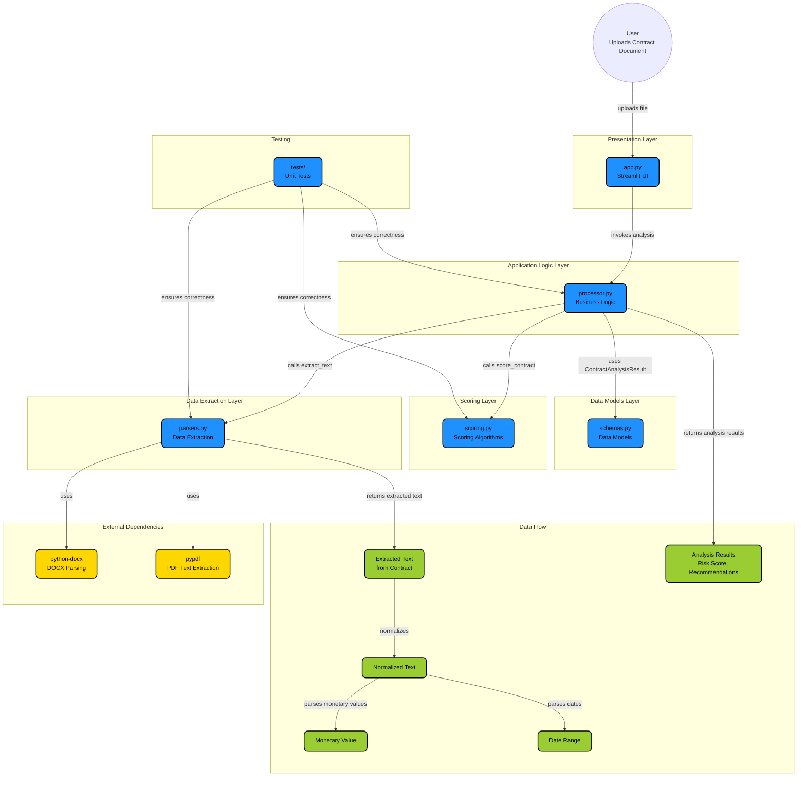

# Architecture

The diagram below shows the high-level architecture of the Contract Assistant Agent, including the presentation layer, application logic, scoring, data extraction, external dependencies, and data flow.

