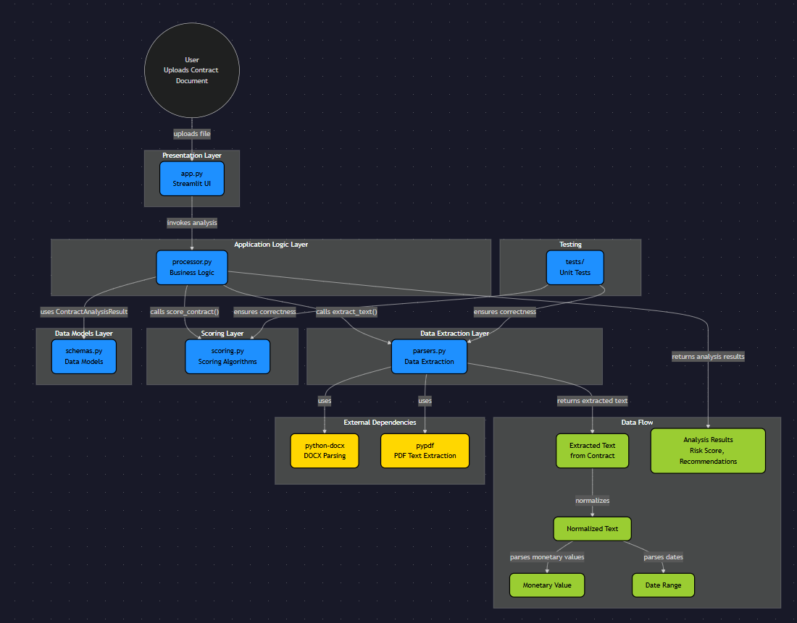

# Contract Assistant Agent

An AI-powered contract renegotiation assistant that analyzes documents, scores opportunities, and generates structured recommendations for legal and procurement workflows.

## Demo Overview

This project demonstrates a local Streamlit demo for contract review and renegotiation prioritization. The workflow extracts key contract data, computes a priority score, and returns actionable recommendations in a structured format.

## What It Does

- Parses contract documents.
- Extracts text, values, and dates.
- Scores contracts by urgency and impact.
- Produces renegotiation recommendations.
- Provides a lightweight Streamlit UI for fast demos.

## Architecture

This project uses a layered architecture for contract analysis, with a Streamlit presentation layer, a processing layer for orchestration and scoring, and dedicated modules for parsing and structured outputs.

- `app.py` — Streamlit front-end.
- `source/parsers.py` — reads `.pdf` and `.docx` files and extracts text, values, and dates.
- `source/scoring.py` — calculates scores, prioritization, and recommendations.
- `source/processor.py` — orchestrates the full workflow.
- `source/schemas.py` — defines structured output data.
- `tests/test_app_ui_english.py` — validates the Streamlit UI flow.
- `tests/test_processor.py` — validates the processing and scoring workflow.



See [ARCHITECTURE.md](./ARCHITECTURE.md) for the full diagram, module relationships, and testing coverage.

## Quick Start

```bash
python -m venv .venv
.venv\Scripts\activate
pip install -r requirements.txt
pytest -q
streamlit run app.py
```

## Demo Use Cases

- Clause review.
- Renegotiation prioritization.
- Savings simulation.
- Internal negotiation draft support.

## Demo Notes

This repository is configured for repeatable local execution in VS Code, making it easier to test, iterate, and present reliably during live demos.